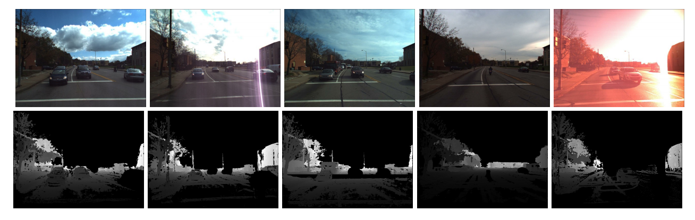

## Visual Perception and Localization

* **Cross-Season Monocular Depth Prediction under Changing Environments**   [[paper](https://arxiv.org/abs/2011.04408)] [[project](https://seasondepth.github.io/)]   
  
A new cross-season scaleless monocular depth prediction dataset is derived from CMU Visual Localization dataset through structure from motion. And then the several metrics are formulated to measure the performance on this dataset. Besides, we have benchmarked almost all the open-source state-of-the-art algorithms on KITTI dataset using the new dataset to find robust methods against the challenging environments. The dataset and benchmark is available on [SeasonDepth](https://seasondepth.github.io/).

